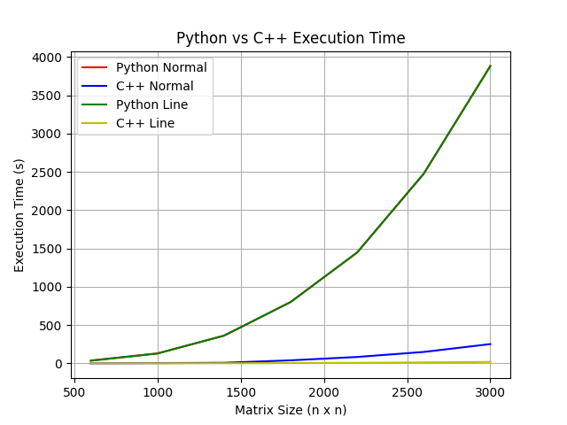
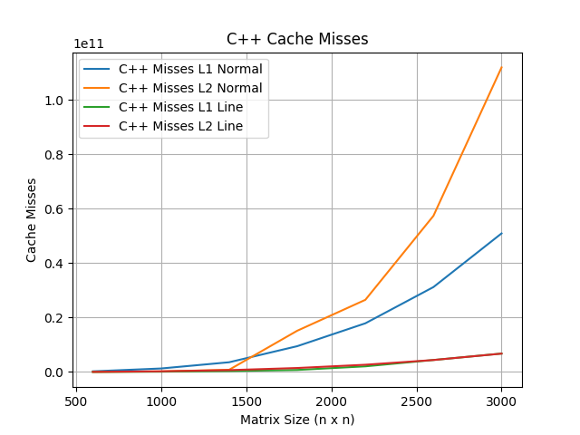
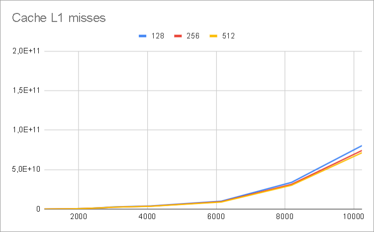
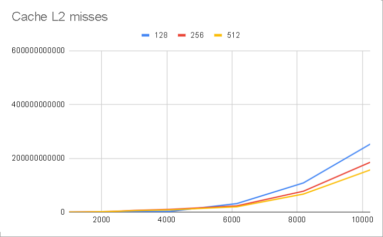
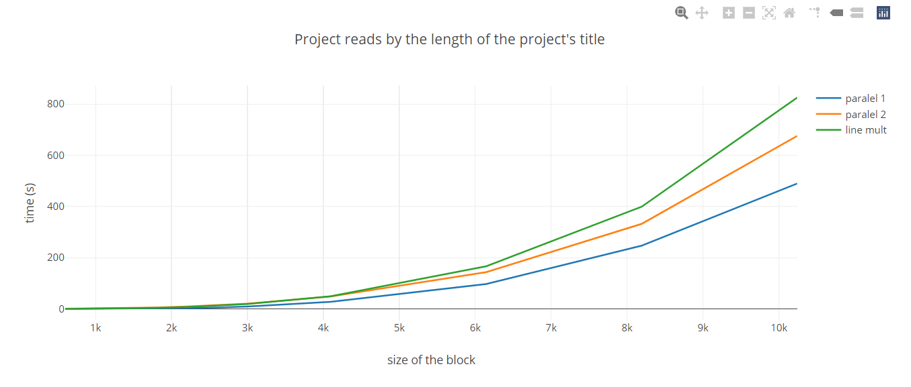
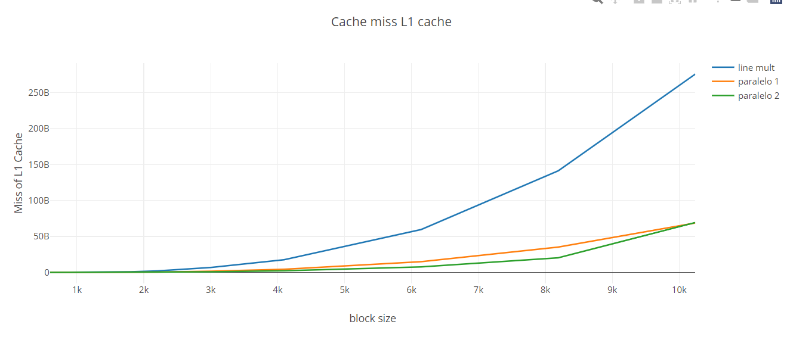
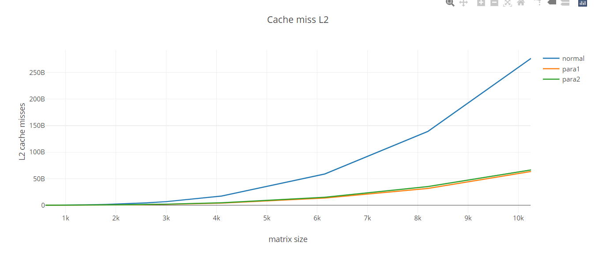
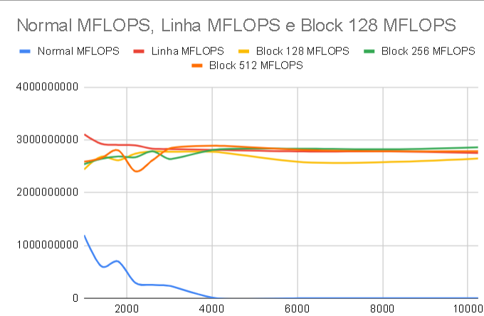
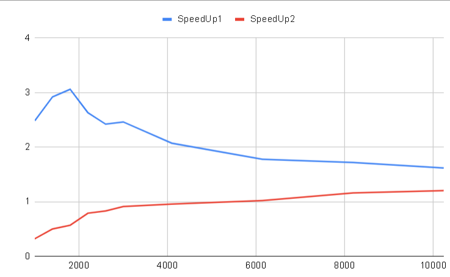
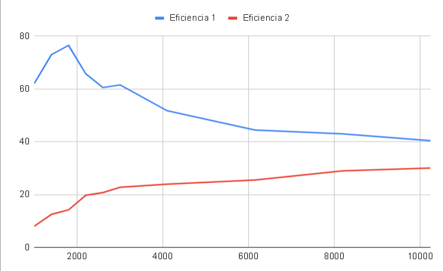

<p align="center"><b>Faculdade De Engenharia Da Universidade Do Porto</b></p>
<p align="center">
  
</p>
<p align="center" style="font-size:20px;"><b>Projeto de CPD 1</b></p>
<br><br>
<p style="font-size:25px;"><b>Índice</b></p>
<ol>
    <li style="font-size:22px;">Descrição do problema</li>
    <li style="font-size:22px;">Explicação dos algoritmos</li>
	    <ul>
            <li style="font-size:15px;">Multiplicação de matrizes Simples</li>
            <li style="font-size:15px;">Multiplicação de matrizes de Linha</li>
            <li style="font-size:15px;">Multiplicação de matrizes de Bloco</li>
			<li style="font-size:15px;">Multiplicação paralela 1</li>
			<li style="font-size:15px;">Multiplicação paralela 2</li>
        </ul>
    <li style="font-size:22px;">Medidas de Perfomance</li>
    <li style="font-size:22px;">Resultados e Análises</li>
    <li style="font-size:22px;">Conclusões</li>
</ol>

<p style="font-size:30px;"><b>1. Descrição do problema</b></p>

<p style="font-size:15px;">Neste problema, o nosso objetivo é estudar o efeito da hierarquia de memória no desempenho do processador quando acedemos a grandes quantidades de dados, seja sequencial ou paralelo. Para este trabalho, vamos usar o produto de 2 matrizes.</p>

<p style="font-size:30px;"><b>2. Explicação dos algoritmos</b></p>

<p style="font-size:15px;">Para este problema, vamos usar 5 algoritmos diferentes para multiplicar as matrizes. Esses algoritmos são:</p>
<ol>
    <li style="font-size:15px;">Multiplicação de matrizes Simples</li>
    <li style="font-size:15px;">Multiplicação de matrizes de Linha</li>
    <li style="font-size:15px;">Multiplicação de matrizes de Bloco</li>
	<li style="font-size:15px;">Multiplicação paralela 1</li>
	<li style="font-size:15px;">Multiplicação paralela 2</li>
</ol>

<p style="font-size:26px;"><b>2.1 Multiplicação de matrizes Simples</b></p>

<p style="font-size:15px;">Este algoritmo é o mais simples dos 3. Neste algoritmo, que nos foi dado, consiste num algoritmo C++ que multiplica a linha da primeira matriz com cada coluna da segunda matriz. A complexidade temporal do algoritmo é O(n^3). Aqui em baixo, podes encontrar o pedaço do código relevante do algoritmo:</p>
<p style="font-size:15px;">Também existe uma versão python deste algoritmo, que está implementada no ficheiro matrix_mult.py.</p>

<p style="font-size:26px;"><b>2.2 Multiplicação de matrizes de Linha</b></p>

<p style="font-size:15px;">Este algoritmo é uma melhoria do algoritmo anterior. Neste algoritmo, em vez de multiplicar a linha da primeira matriz com cada coluna da segunda matriz, multiplicamos um elemento da primeira matriz pela linha correspondente da segunda matriz.No entanto, a complexidade mantém-se. Aqui em baixo, podes encontrar o pedaço do código relevante do algoritmo:</p>

```c++
    for( i=0; i<m_ar; i++) // Percorre as linhas da primeira matriz
        for( k=0; k<m_br; k++) // Percorre as colunas da segunda matriz
            for(j=0; j<m_br; j++) // Percorre os elementos na linha atual da primeira matriz e na coluna atual da segunda matriz
                // Multiplica o elemento atual da primeira matriz pelo elemento atual da segunda matriz e adiciona o resultado à posição correspondente na terceira matriz
                phc[i*m_ar+j] += pha[i*m_ar+k] * phb[k*m_br+j];
```

<p style="font-size:15px;">Também existe uma versão python deste algoritmo, que se pode encontrar no ficheiro matrix_mult.py.</p>

<p style="font-size:26px;"><b>2.3 Multiplicação de matrizes de Bloco</b></p>

<p style="font-size:15px;">Neste algoritmo, em vez de multiplicar um elemento da primeira matriz pela linha correspondente da segunda matriz, nós dividimos as matrizes em blocos e realizamos a multiplicação de matrizes em cada bloco, que no final serão juntadas. Isto pode passar a ser mais eficiente se as matrizes forem relativamente grandes. No entanto, a complexidade temporal do algoritmo ainda é O(n^3). Podes encontrar o pedaço do código relevante do algoritmo:</p>

```c++
 for (i_blk = 0; i_blk < m_ar; i_blk += bkSize) { // Percorre os blocos de linhas da primeira matriz
        for (j_blk = 0; j_blk < m_br; j_blk += bkSize) { // Percorre os blocos de colunas da segunda matriz
            for (k_blk = 0; k_blk < m_ar; k_blk += bkSize) { // Percorre os blocos de elementos na linha atual da primeira matriz e na coluna atual da segunda matriz
                for (i = i_blk; i < min(i_blk + bkSize, m_ar); i++) { // Percorre as linhas dentro do bloco atual da primeira matriz
                    for( k=k_blk; k<min(k_blk + bkSize, m_ar); k++) { // Percorre os elementos dentro do bloco atual da linha da primeira matriz e da coluna da segunda matriz
                        for (j = j_blk; j < min(j_blk + bkSize, m_br); j++) { // Percorre as colunas dentro do bloco atual da segunda matriz
                            // Multiplica o elemento atual da primeira matriz pelo elemento atual da segunda matriz e adiciona o resultado à posição correspondente na terceira matriz
                            phc[i*m_ar+j] += pha[i*m_ar+k] * phb[k*m_br+j];
```

<p style="font-size:26px;"><b>2.4 Multiplicação paralela 1</b></p>

<p style="font-size:15px;">Este algoritmo é uma versão paralela do algoritmo de multiplicação de matrizes de linha. Utilizamos a biblioteca OpenMP para paralelizar o "for" mais externo. Cada iteração do "for" mais externo é independente das outras, o que significa que podem ser executadas em paralelo sem causar condições de corrida. A execução será mais rápida num sistema com múltiplos núcleos de processamento. Aqui em baixo, podes encontrar o pedaço do código relevante do algoritmo:</p>

```c++
#pragma omp parallel for // A diretiva OpenMP para paralelizar o loop seguinte
for(i=0; i<m_ar; i++) // Percorre as linhas da primeira matriz
    for( k=0; k<m_br; k++) // Percorre as colunas da segunda matriz
        for(j=0; j<m_br; j++) // Percorre os elementos na linha atual da 
            phc[i*m_ar+j] += pha[i*m_ar+k] * phb[k*m_br+j]; 
```

<p style="font-size:26px;"><b>2.5 Multiplicação paralela 2</b></p>

<p style="font-size:15px;">Este segundo algoritmo é uma variação do primeiro algoritmo de multiplicação de matrizes paralelas. A principal diferença está na localização da diretiva #pragma omp for, sendo que no segundo algoritmo, o #pragma omp parallel é colocado antes do "for" mais externo, mas  #pragma omp for é colocada antes do "for" mais interno. Isso significa que todas as threads participam na execução de cada iteração do "for" mais externo, mas as iterações do "for" mais interno são distribuídas entre as threads. Cada thread executa uma parte do "for" mais interno para cada iteração do "for" mais externo. Também é importante referir que como as variaveis i,j,k são usados em threads diferentes e são defenidas fora do for paralelizado o address das variaveis vai ser igual sabendo que se estam a iterar os valores i j k não queremos que as threads partilhem estes valores, adicionando o private os address destas variaveis de thread para thread são diferentes.</p>

```c++
    #pragma omp parallel private(i, j, k) // Inicia um processo paralelo e torna i,j,k privados para cada thread
    for(i=0; i<matrixARows; i++){ 
        for(k=0; k<matrixBRows; k++){
            #pragma omp for // Distribuir as iterações do for entre as threads
            for(j=0; j<matrixBRows; j++)
                productMatrix[i*matrixARows+j] += matrixA[i*matrixARows+k] * matrixB[k*matrixBRows+j];

```

<p style="font-size:30px;"><b>3. Medidas de Perfomance</b></p>

<p style="font-size:15px;">Tal como indicado na descrição do projeto, utilizamos uma livraria / API "PAPI", que dá acesso a várias medidas relacionadas com o CPU, como por exemplo a memória usada do Cpu e os caches hits/misses. Para garantir a validade e veracidade dos dados obtidos, são partilhados aqui os "specs" do computador em teste, bem como o facto de ter feito 3 testes para cada dado (apenas validável aos dados que não ultrapassem 40s de execução). 
O computador em questão tem o sistema operativo Windows 10 Home 22H2, tem um CPU Intel i5-7300HQ 2.50Gz com 4 cores, com 8GB de RAM disponíveis (2400MHz). A cache L1 tem 256KB,L2 tem 1.0MB e L3 tem 6.0MB. Para cada teste com algoritmo diferente, foi iniciado outro programa e fechado o anterior, para permitir uma alocação independente de memória entre cada algoritmo. Tal como foi indicado nas aulas práticas, foi recomendado usar a flag -O2 para aumentar a perfomance do código compilado, aumentando assim um pouco o tempo de compilação. Os dados diretos registados do programa foram tempo de execução (em segundos), Data Cache Misses do L1 e L2. Os dados a ser calculados à mão serão MFLOPS (Million Floating Point Operations Per Second), SpeedUp e Eficiência.</p>

<p style="font-size:20px;"><b>3.1 Medidas usadas para aumentar o performance em python</b></p>

<p style="font-size:15px;">Em python a tradução do codigo de c para python não basta comparando os resultados da multiplicação de linha para a multiplicação normal a multiplicação de linha ficava pior então nos usavamos variaveis para defenir arrays ou valores que seriam usados multiplas vezes de forma o obrigar o python a dar cache dos valores por exemplo:</p>
<p style="font-size:30px;"><b>4. Resultados e Análises</b></p>

<p style="font-size:15px;">Nesta secção vamos apresentar as tabelas de dados relevantes à análise e explicação dos algoritmos usados neste projeto.</p>

<p style="font-size:26px;"><b>4.1 Comparação entre Algoritmo de multiplicação Normal e Linha</b></p>


<div style="display: flex; justify-content: space-around;">
  
   
</div>

<p style="font-size:15px;">Com base nos dados coletados, podemos tirar várias conclusões importantes. Primeiro, é evidente que a implementação em C++ é significativamente mais rápida do que a implementação em Python para ambos os algoritmos de multiplicação de matrizes. Isso é esperado, pois C++ é uma linguagem compilada que geralmente oferece desempenho superior ao Python, que é uma linguagem interpretada. Segundo, embora não haja diferenças significativas entre os 2 algoritmos em Python, em C++, o algoritmo de linha é mais eficiente que o algoritmo normal, devido à maneira como o algoritmo de linha acede as duas matrizes, de linha para linha e quando se vai buscar algum objeto de uma array a memoria é adicionado na cache tanto esse valor como valores proximos deles por exemplo parte da linha como as linhas são iteradas neste algoritmo os valores já vão estar em cache o que vai diminuir os caches misses, em comparação com o normal que quando itera uma matrix pelo valor de coluna a coluna a cache vai estar a adicionar parte da linha mas não a vai chegar a utilizar sendo esses valores descartados quando puderiam ser usados pois o tamanho da cache é limitada, o que pode resultar em um uso menos eficiente da cache do CPU. Isso também reflete nos caches misses.</p>


<p style="font-size:26px;"><b>4.2 Comparação entre L1 e L2 cache misses de Block</b></p>

<div style="display: flex; justify-content: space-around;">
  
  
</div>

<p style="font-size:15px;">Através da análise dos dados recolhidos, concluimos que o tamanho do bloco não influenciou significativamente o desempenho deste nível de cache, pois é o principal e também o mais rápido. Isso pode ser devido ao fato de que, em um bloco de 256x256, que aloca um tipo double em cada célula de 8 bytes, ocupa 256KB na memória, o que, para o i5 7300, equivale a toda a cache L1, assim como parte de L2. No entanto, para os tamanhos de bloco maiores, 256 e 512, mostra ser mais eficiente em termos de misses de cache L2, já que ainda há memória não ocupada na cache L2 para o bloco de 128. O mesmo se conclui para o de 512.</p>


<p style="font-size:26px;"><b>4.3 Comparação entre Paralelo 1 e Paralelo 2</b></p>

<div style="display: flex; justify-content: space-around;">
  
   
   
</div>

<p style="font-size:15px;">Analisando os dados, o Paralelo 1 tem menor tempo de execução que o Paralelo 2, embora ambos sejam mais eficientes que a multiplicação Linha sequencial. Isto deve-se ao facto de o Paralelo 1 utilizar único comando OpenMP para paralelizar o for externo, o que pode resultar em uma melhor utilização dos recursos do processador e uma redução no overhead de paralelização. Por outro lado, o Paralelo 2 paraleliza tanto o for externo quanto o for interno, o que pode introduzir mais overhead de sincronização entre threads e reduzir a eficiência.
Além disso, o Paralelo 1 parece ter ligeiramente mais caches misses no L1 e não há uma diferença significativa no L2.</p>
<p style="font-size:26px;"><b>4.4 MFLOPS, SpeedUp e Eficiência</b></p>


<div style="display: flex; justify-content: space-around;">
  
   
   
</div>

<p style="font-size:15px;">Em termos de MFLOPS,.Em termos de SpeedUp, podemos reparar que inicialmente o paralelo1 é melhor que o paralelo2, mas quanto maior for o tamanho do dado, começa a acontecer o oposto. Isto deve-se provavelmente ao fato de que o paralelo2 distribui o trabalho de uma maneira que é mais eficiente para conjuntos de dados maiores. No paralelo1, o trabalho é distribuído no for mais externo, o que significa que cada thread é responsável por uma linha inteira da matriz. Isso pode levar a um desequilíbrio de carga se algumas linhas demorarem mais para serem processadas do que outras. No paralelo2, o trabalho é distribuído no for mais interno, o que significa que cada thread é responsável por uma única operação de multiplicação e adição. Isto também vai influenciar a eficiência, dado que a eficiência é calculada através de "speedup/cores". </p>

<p style="font-size:30px;"><b>5. Conclusões</b></p>

<p style="font-size:15px;">Em conclusão, conseguimos perceber que os conceitos e teorias, que foram ensinadas nas aulas teóricas, podiam ser aplicados neste trabalho e os seus efeitos nos resultados observados, tanto para os programas sequenciais, como para os paralelos. Também foi interessante aplicar as técnicas necessárias para melhorar os desempenhos dos programas.
</p>
<a href=https://docs.google.com/spreadsheets/d/197V1KMSqUTFJnGinQ_Q7ub3Wc1TLQWRoM6auXsfyjaM/edit?usp=sharing>Spreadsheet</a>

